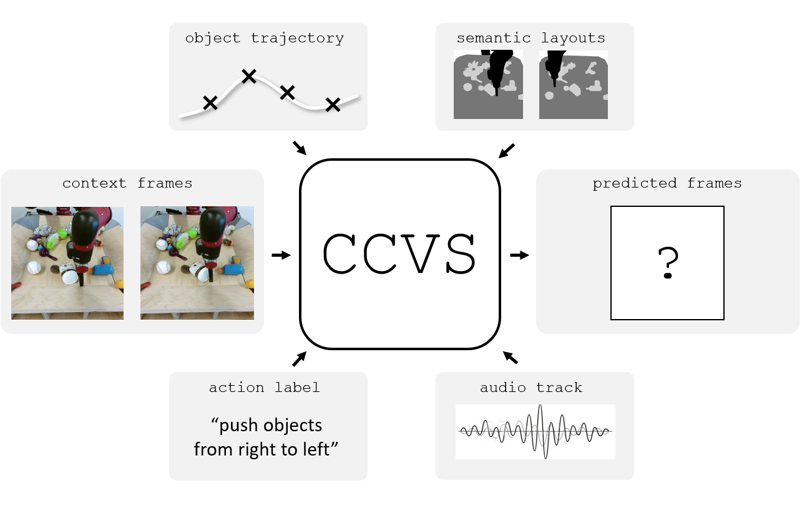

# CCVS - Official PyTorch Implementation

Code for NeurIPS paper [CCVS: Context-aware Controllable Video Synthesis](https://arxiv.org/abs/2107.08037).

<p align="center"></p>

> **CCVS: Context-aware Controllable Video Synthesis**<br>
> [Guillaume Le Moing](https://16lemoing.github.io/), [Jean Ponce](https://www.di.ens.fr/~ponce), [Cordelia Schmid](https://thoth.inrialpes.fr/~schmid) <br>

> Paper: https://arxiv.org/abs/2107.08037 <br>
> Project page: https://16lemoing.github.io/ccvs <br>

> **Abstract:** *This presentation introduces a self-supervised learning approach to the synthesis of new video clips from old ones, with several new key elements for improved spatial resolution and realism: It conditions the synthesis process on contextual information for temporal continuity and ancillary information for fine control. The prediction model is doubly autoregressive, in the latent space of an autoencoder for forecasting, and in image space for updating contextual information, which is also used to enforce spatio-temporal consistency through a learnable optical flow module. Adversarial training of the autoencoder in the appearance and temporal domains is used to further improve the realism of its output. A quantizer inserted between the encoder and the transformer in charge of forecasting future frames in latent space (and its inverse inserted between the transformer and the decoder) adds even more flexibility by affording simple mechanisms for handling multimodal ancillary information for controlling the synthesis process (eg, a few sample frames, an audio track, a trajectory in image space) and taking into account the intrinsically uncertain nature of the future by allowing multiple predictions. Experiments with an implementation of the proposed approach give very good qualitative and quantitative results on multiple tasks and standard benchmarks.*

## Installation
The code is tested with pytorch 1.7.0 and python 3.8.6

To install dependencies with conda run:
```
conda env create -f env.yml
conda activate ccvs
```

To install apex run:
```
cd tools
git clone https://github.com/NVIDIA/apex
cd apex
pip install -v --no-cache-dir --global-option="--cpp_ext" --global-option="--cuda_ext" ./
cd ../..
```

## Prepare datasets

**BAIR Robot Pushing** - ([Repo](https://sites.google.com/berkeley.edu/robotic-interaction-datasets)) - ([License](https://creativecommons.org/licenses/by/4.0/legalcode))

Create corresponding directory:
```
mkdir datasets/bairhd
```
Download the high resolution data from [this link](https://drive.google.com/file/d/1rxp_PenuctchTUzA0Tp_wO-CdfxOB73F/view) and put it in the new directory, then run:
```
tar -xvf datasets/bairhd/softmotion_0511.tar.gz -C datasets/bairhd
```
Preprocess BAIR dataset for resolution 256x256:
```
python data/scripts/preprocess_bairhd.py --data_root datasets/bairhd --dim 256
```
We also provide our annotation tool to later estimate the (x,y) position of the arm:
```
python data/scripts/annotate_bairhd.py --data_root datasets/bairhd/original_frames_256 --out_dir datasets/bairhd/annotated_frames
```
**Kinetics-600** - ([Repo](https://deepmind.com/research/open-source/kinetics)) - ([License](https://creativecommons.org/licenses/by/4.0/legalcode))

This dataset is a collection of YouTube links from which we extract the corresponding train and test videos running:
```
mkdir datasets/kinetics
wget https://storage.googleapis.com/deepmind-media/Datasets/kinetics600.tar.gz -P datasets/kinetics
tar -xvf datasets/kinetics/kinetics600.tar.gz -C datasets/kinetics
python  data/scripts/download_kinetics.py datasets/kinetics/kinetics600/train.csv datasets/kinetics/kinetics600/train_videos --trim
python  data/scripts/download_kinetics.py datasets/kinetics/kinetics600/test.csv datasets/kinetics/kinetics600/test_videos --trim
```

Preprocess the dataset:
```
python data/scripts/preprocess_kinetics.py --src_folder datasets/kinetics/kinetics600/train_videos --out_root datasets/kinetics/preprocessed_videos --out_name train_64p_square_32t --max_vid_len 32 --resize 64 --square_crop
python data/scripts/preprocess_kinetics.py --src_folder datasets/kinetics/kinetics600/test_videos --out_root datasets/kinetics/preprocessed_videos --out_name test_64p_square_32t --max_vid_len 32 --resize 64 --square_crop
```

Split the data into folds and precompute metadata for faster training/testing:
```
python data/scripts/compute_folds_kinetics.py train 100 64p_square_32t
python data/scripts/compute_folds_kinetics.py test 40 64p_square_32t --max_per_fold 1248
```

**AudioSet-Drums** - ([Repo](http://research.google.com/audioset/download.html)) - ([License](https://creativecommons.org/licenses/by/4.0/legalcode)) - ([License of curated version](datasets/DRUMS_LICENSE))

Create corresponding directory:
```
mkdir datasets/drums
```
Download the data from [this link](https://www.dropbox.com/s/7ykgybrc8nb3lgf/AudioSet_Drums.zip?dl=0) and run:
```
unzip datasets/drums/AudioSet_Drums.zip -d datasets/drums
```

## Training

**BAIR Robot Pushing**

First, train the frame autoencoder:
```
bash scripts/bairhd/train_frame_autoencoder.sh
```

Then, train the transformer for different tasks (one should change `--q_load_path` in the corresponding files to point to the checkpoints of the trained autoencoder) :

- Video prediction
```
bash scripts/bairhd/train_transformer.sh
``` 
- Point-to-point synthesis
```
bash scripts/bairhd/train_transformer_p2p.sh
``` 
- State-conditioned synthesis (this requires to train a state estimator first and change the corresponding `--s_load_path` before training the transformer)
```
bash scripts/bairhd/train_state_estimator.sh
bash scripts/bairhd/train_transformer_state.sh
``` 
- Unconditional synthesis
```
bash scripts/bairhd/train_transformer_unc.sh
``` 

**Kinetics-600**

The same applies, *e.g.*, for video prediction:
```
bash scripts/kinetics/train_frame_autoencoder.sh
bash scripts/kinetics/train_transformer.sh
``` 

**AudioSet-Drums**

For audio-conditioned synthesis, we train two encoders (one to compress frames, the other to compress sound features) and then train the transformer:
```
bash scripts/drums/train_frame_autoencoder.sh
bash scripts/drums/train_stft_autoencoder.sh
bash scripts/drums/train_transformer_audio.sh
```

## Inference

We provide checkpoints for various configurations:
<table>
  <tr>
    <th>Dataset</th>
    <th>Future prediction</th>
    <th>Point-to-point synthesis</th>
    <th>State-conditioned synthesis</th>
    <th>Sound-conditioned synthesis</th>
    <th>Unconditional synthesis</th>
    <th>Download</th>
  </tr>
  <tr>
    <td>BAIR Robot Pushing</td>
    <td align="center">&check;</td>
    <td align="center">&check;</td>
    <td align="center">&check;</td>
    <td align="center">&cross;</td>
    <td align="center">&check;</td>
    <td align="center"><a href="https://drive.google.com/file/d/16V5HhP58T1K8jQhXN5Pc-TIc987twa4m/view?usp=sharing">checkpoint</a></td>
  </tr>
  <tr>
    <td>Kinetics-600</td>
    <td align="center">&check;</td>
    <td align="center">&check;</td>
    <td align="center">&cross;</td>
    <td align="center">&cross;</td>
    <td align="center">&cross;</td>
    <td align="center"><a href="https://drive.google.com/file/d/1m_uhOod9ZYHSfykBFWdp_6C58EH-4BNF/view?usp=sharing">checkpoint</a></td>
  </tr>
  <tr>
    <td>AudioSet-Drum</td>
    <td align="center">&check;</td>
    <td align="center">&cross;</td>
    <td align="center">&cross;</td>
    <td align="center">&check;</td>
    <td align="center">&cross;</td>
    <td align="center"><a href="https://drive.google.com/file/d/1F5LkravqkjSQMogJ0s1sTwQhryaOfPy1/view?usp=sharing">checkpoint</a></td>
  </tr>
</table>

Extract checkpoints with the following command (by replacing `CKPT.zip` with the corresponding name).
```
unzip CKPT.zip -d checkpoints/
```

Synthesize videos from downloaded checkpoints.

**BAIR Robot Pushing**

```
bash scripts/bairhd/save_videos_state_off.sh
bash scripts/bairhd/save_videos_p2p.sh
bash scripts/bairhd/save_videos_state_on.sh
bash scripts/bairhd/save_videos_unc.sh
``` 

**Kinetics-600**

```
bash scripts/kinetics600/save_videos.sh
bash scripts/kinetics600/save_videos_p2p.sh
``` 

**AudioSet-Drums**

```
bash scripts/drums/save_videos_audio_off.sh
bash scripts/drums/save_videos_audio_on.sh
``` 

Here are some important flags: 
- `--vid_len`: the total number of frames in synthetic videos (including conditioning frames)
- `--x_cond_len`: the length of tokens corresponding to conditioning frames. In the preceding experiments one frame is represented by 64 tokens so one can set this flag to `0` for unconditionnal synthesis, `64` for one input frame, `128` for two...
- `--keep_state`: add this flag in sound- or state- conditioned synthesis to effectvely use the control (otherwise sound / state are also predicted)

## Evaluation

After inference, compute evaluation metrics with the following commands:
```
python tools/tf_fvd/fvd.py --exp_tag TAG
python tools/pytorch_metrics/metrics.py --exp_tag TAG
```
where `TAG` is the name of the directory (inside `results/` folder) under which videos where saved during inference.
The first command computes the [Fréchet video distance](https://github.com/google-research/google-research/tree/master/frechet_video_distance) (FVD), and second one the peak signal-to-noise ratio (PSNR) and the structural similarity index measure (SSIM).
One can use the `--idx` flag to compute PSNR / SSIM for specific timesteps.

## Citation

If you find this code useful in your research, please consider citing:

    @inproceedings{lemoing2021ccvs,
      title     = {{CCVS}: Context-aware Controllable Video Synthesis},
      author    = {Guillaume Le Moing and Jean Ponce and Cordelia Schmid},
      booktitle = {NeurIPS},
      year      = {2021}
    }

## Acknowledgments

This code borrows from [StyleGAN2](https://github.com/rosinality/stylegan2-pytorch), [minGPT](https://github.com/karpathy/minGPT), [pytorch-liteflownet](https://github.com/sniklaus/pytorch-liteflownet) and [VQVAE](https://github.com/MishaLaskin/vqvae).

## License

CCVS is released under the [MIT license](LICENSE).
